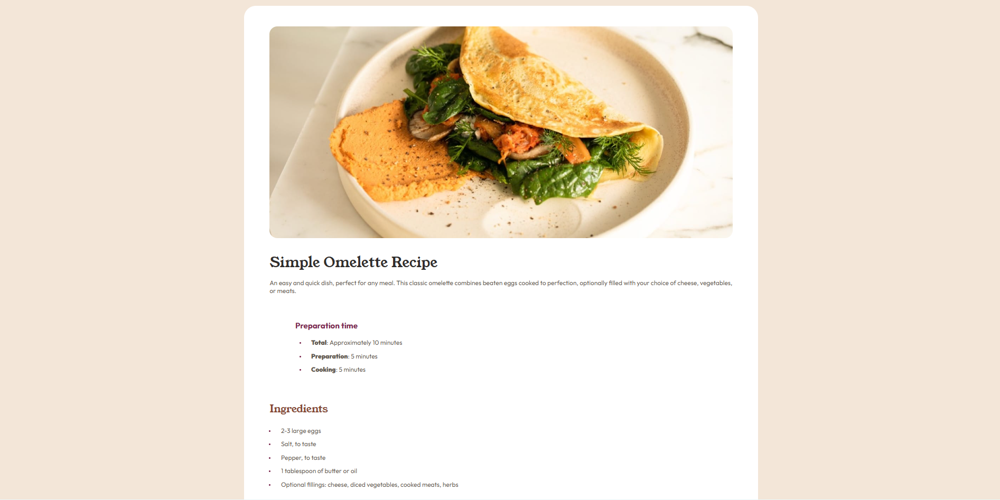

# CTI-110 Final Project - Recipe page solution

## Table of contents

- [CTI-110 Final Project - Recipe page solution](#cti-110-final-project---recipe-page-solution)
  - [Table of contents](#table-of-contents)
  - [Overview](#overview)
    - [Screenshot](#screenshot)
    - [Links](#links)
  - [My process](#my-process)
    - [Built with](#built-with)
    - [What I learned](#what-i-learned)
    - [Continued development](#continued-development)
    - [Useful resources](#useful-resources)
  - [Author](#author)
  - [Acknowledgments](#acknowledgments)

**Note: Delete this note and update the table of contents based on what sections you keep.**

## Overview

### Screenshot



### Links

- Repository URL: [Add repository URL here](https://github.com/VampiricDuck/recipe-page.git)
- Live Site URL: [Add live site URL here](https://vampiricduck.github.io/recipe-page/)

## My process

### Built with

- HTML
- CSS

**Note: These are just examples. Delete this note and replace the list above with your own choices**

### What I learned

Throughout this project I've encountered a number of hurdles to overcome. For HTML, I learned how to properly make a table using tr and td tags to designate what lines go in each row, and what lines are the data that go into said row. CSS I’ve had a number of troubles, but I did how to properly incorporate fonts by first linking them in the html fine then using them. Learning div structures has also been a quick reminder, while the basic concept had been acquired i was still getting stuck, and so google I did and quickly came to the conclusion that divs are like boxed, literally. The last thing I truly learned was styling a table. Having to class specific data and highlighting the bottom border of the cells. 

### Continued development

I want to continue to learn better ways to sort my HTML, and of course learning more css.

### Useful resources

- [W3schools](https://www.w3schools.com/) - This was baisicly the only online tool I've used for the entire project. its a lovley tool becaues it gives information about everything your ready and provides examples and their outputs.

## Author

- GitHub - [Serena Rogers](https://github.com/VampiricDuck)

## Acknowledgments

I'd like to Acknowledge Mr.Gardner for the consistent support and walking though my questions. Elnatan for helping me format the lists properly. And Henry and Yusuke for their help as another set of eyes on troubleshooting.
const proudOfThisFunc = () => {
  console.log('🎉')
}
```

If you want more help with writing markdown, we'd recommend checking out [The Markdown Guide](https://www.markdownguide.org/) to learn more.

**Note: Delete this note and the content within this section and replace with your own learnings.**

### Continued development

Use this section to outline areas that you want to continue focusing on in future projects. These could be concepts you're still not completely comfortable with or techniques you found useful that you want to refine and perfect.

**Note: Delete this note and the content within this section and replace with your own plans for continued development.**

### Useful resources

- [Example resource 1](https://www.example.com) - This helped me for XYZ reason. I really liked this pattern and will use it going forward.
- [Example resource 2](https://www.example.com) - This is an amazing article which helped me finally understand XYZ. I'd recommend it to anyone still learning this concept.

**Note: Delete this note and replace the list above with resources that helped you during the challenge. These could come in handy for anyone viewing your solution or for yourself when you look back on this project in the future.**

## Author

- Website - [Add your name here](https://www.your-site.com)

**Note: Delete this note and add/remove/edit lines above based on what links you'd like to share.**

## Acknowledgments

This is where you can give a hat tip to anyone who helped you out on this project. Perhaps you worked in a team or got some inspiration from someone else's solution. This is the perfect place to give them some credit.

**Note: Delete this note and edit this section's content as necessary. If you completed this challenge by yourself, feel free to delete this section entirely.**
